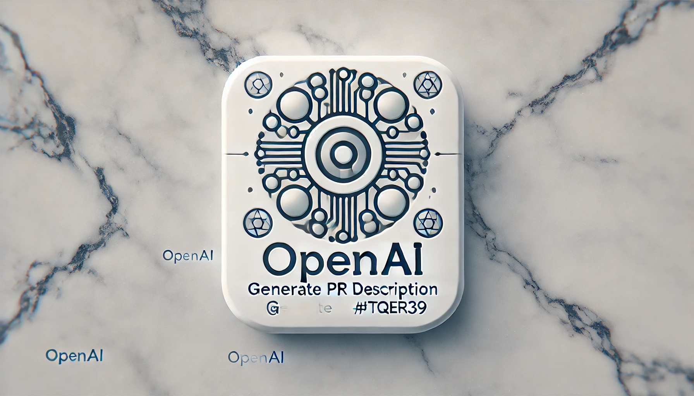

<p align="center">
  <a href="">
    
  </a>
  <h1 align="center">OpenAI Generate PR Title and Description</h1>
</p>

<p align="center">
  <i>このワークフローでは OpenAI による文章生成モデルを使って、プルリクエストのタイトルと本文を生成します。</i>
</p>

## 使い方

```yaml
name: OpenAI Generate PR Title and Description

on:
  pull_request:
    branches:
      - main
    types:
      - opened
      - synchronize

jobs:
  pull-request:
    runs-on: ubuntu-latest
    timeout-minutes: 10
    permissions:
      pull-requests: write
    if: contains(fromJSON('["renovate[bot]"]'), github.event.pull_request.user.login) == false
    steps:
      - uses: actions/checkout@v4
      - uses: tqer39/openai-generate-pr-description@v1.0.2
        with:
          github-token: ${{ secrets.GITHUB_TOKEN }}
          openai-api-key: ${{ secrets.OPENAI_API_KEY }}
```

## Inputs

### `github-token`

**必須** GitHub トークン。`${{ secrets.GITHUB_TOKEN }}` を指定します。

### `openai-api-key`

**必須** OpenAI API キー。`${{ secrets.OPENAI_API_KEY }}` を指定します。

## 貢献方法

問題や課題が発見されたら Issue を作成するか Pull Request を作成していただけると幸いです。

## ライセンス

このアクションは MIT ライセンスのもとで公開されています。詳細については [LICENSE](LICENSE) を参照してください。
